# Análisis de Mortalidad en Colombia 2019

## Introducción del proyecto
Esta aplicación permite explorar los datos de mortalidad no fetal de Colombia
correspondientes al año 2019, publicados por el DANE en las Estadísticas
Vitales (EEVV). La herramienta transforma datos en visualizaciones
interactivas que facilitan la identificación de patrones demográficos,
geográficos y temporales de la mortalidad en el país.


## Tabla de contenidos

- [Objetivo](#objetivo)
- [Estructura del proyecto](#estructura-del-proyecto)
- [Requisitos](#requisitos)
- [Despliegue en Render](#despliegue-en-render)
- [Software](#software)
- [Instalación](#instalación)
- [Visualizaciones con explicaciones de los resultados](#visualizaciones-con-explicaciones-de-los-resultados)
- [Fuentes de datos](#fuentes-de-datos)
- [Informe](#informe)


## Objetivo
Analizar la mortalidad no fetal en Colombia para el año 2019 mediante
visualizaciones interactivas que permitan identificar:
  - La distribución geográfica de muertes por departamento.
  - La evolución mensual de defunciones a lo largo del año.
  - Las ciudades con mayor incidencia de homicidios con arma de fuego (X95).
  - Las ciudades con menor índice de mortalidad.
  - Patrones de mortalidad a lo largo del ciclo de vida.
  - Diferencias de mortalidad entre sexos por departamento.
  - Las principales causas de muerte según los códigos CIE-10.


## Estructura del proyecto

```bash
App1-Act04_AppWeb-Mortalidad-Colombia-2019
├── app.py                                        # Aplicación principal Dash
├── Procfile                                      # Comando de inicio para Render
├── render.yaml                                   # Configuración del servicio en Render
├── requirements.txt                              # Dependencias de Python necesarias para la aplicación
├── README.md                                     # Documentación del proyecto
├── data/
│   ├── Anexo1.NoFetal2019_CE_15-03-23.xlsx       # Base principal de mortalidad en Colombia 2019
│   ├── Anexo2.CodigosDeMuerte_CE_15-03-23.xlsx   # Códigos de causas de muerte
│   └── Divipola_CE.xlsx                          # División Político-Administrativa de Colombia
├── assets/
│   └── colombia.geo.json                         # Geometría para mapa coroplético
├── images/
│   ├── mapa_departamentos.png                    # Captura del mapa coroplético
│   ├── muertes_por_mes.png                       # Captura de la serie mensual
│   ├── homicidios_x95.png                        # Captura del gráfico de homicidios
│   ├── menor_mortalidad.png                      # Captura del gráfico de menor mortalidad
│   ├── causas_muerte.png                         # Captura de la tabla de causas
│   ├── sexo_departamento.png                     # Captura del gráfico por sexo
│   └── grupos_edad.png                           # Captura del gráfico por edad
└── informe/
    └── informe_mortalidad-colombia-2019.pdf      # Informe final del proyecto
```

La aplicación conserva esta estructura para garantizar el funcionamiento correcto de las rutas locales 
en ejecución local y durante el despliegue en Render. 
Los datos se cargan desde la carpeta `data/`, mientras que los recursos del mapa se ubican en `assets/`.


## Requisitos

- Python 3.13
- Librerías especificadas en `requirements.txt`

| Librería                  | Versión |
|---------------------------|---------|
| dash                      | 2.17.1  |
| dash-bootstrap-components | 1.6.0   |
| pandas                    | 2.2.3   |
| plotly                    | 5.22.0  |
| openpyxl                  | 3.1.3   |
| gunicorn                  | 22.0.0  |


## Software / Plataformas

| Herramienta                     | Versión | Propósito                                              |
| :---------------------------    | :------ | :----------------------------------------------------- |
| **python**                      | 3.13.0  | Lenguaje principal de desarrollo                       |
| **dash**                        | 2.17.1  | Framework para construir la aplicación web interactiva |
| **dash-bootstrap-components**   | 1.6.0   | Estilos y diseño responsivo de la interfaz de usuario  |
| **plotly**                      | 5.22.0  | Librería para visualizaciones interactivas             |
| **pandas**                      | 2.2.3   | Limpieza y transformación de datos                     |
| **numpy**                       | 1.26.4  | Soporte para procesamiento numérico                    |
| **openpyxl**                    | 3.1.3   | Lectura de archivos Excel                              |
| **gunicorn**                    | 22.0.0  | Servidor WSGI para despliegue en producción            |
| **Render**                      | Cloud   | Plataforma de publicación en la nube                   |
| **GitHub**                      | Cloud   | Control de versiones y alojamiento del repositorio     |


## Despliegue en Render
Para desplegar la aplicación en Render se siguieron los siguientes pasos:

1. Crear una cuenta en [Render](https://render.com/) y una cuenta en [GitHub]
   (https://github.com/), si aún no se dispone de ellas.
2. Subir el repositorio completo a GitHub, incluyendo los archivos 
   `app.py`, `Procfile`, `render.yaml`, `requirements.txt` 
   y las carpetas `data/`, `assets/`, `images/` e `informe/`, para garantizar que todos 
   los recursos requeridos estén disponibles durante el despliegue.
3. Ingresar a Render y seleccionar la opción **New Web Service** 
   para crear un nuevo servicio web asociado al repositorio.
4. Conectar la cuenta de GitHub con Render y seleccionar el repositorio correspondiente al proyecto.
5. Configurar el servicio con los siguientes parámetros:
   - **Build Command:** `pip install -r requirements.txt`
   - **Start Command:** `gunicorn app:server --workers 1 --timeout 120`
6. Verificar que el archivo `app.py` incluya la instrucción `server = app.server`, 
   ya que esta línea permite exponer correctamente el servidor Flask utilizado por Dash para el despliegue.
7. Confirmar la creación del servicio y esperar a que Render complete el proceso de construcción y despliegue. Una vez finalizado, la plataforma genera una URL pública desde la cual se puede acceder a la aplicación.

La aplicación debe mantener rutas relativas correctas hacia los archivos ubicados en `data/` y `assets/`, de manera que funcione tanto en entorno local como en el entorno desplegado en Render.


## Instalación

```bash
# 1. Clonar el repositorio
git clone https://github.com/<usuario>/<repositorio>.git
cd <repositorio>

# 2. Crear entorno virtual
python -m venv venv

# 3. Activar entorno virtual
source venv/bin/activate
# En Windows:
# venv\Scripts\activate

# 4. Instalar dependencias
pip install -r requirements.txt

# 5. Ejecutar la aplicación
python app.py
```

Si la instalación es correcta, la aplicación quedará disponible localmente 
en `http://localhost:8050`, que es el puerto usual de ejecución de Dash en desarrollo.


## Visualizaciones

### Visualización general
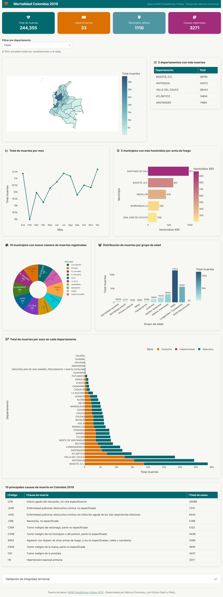
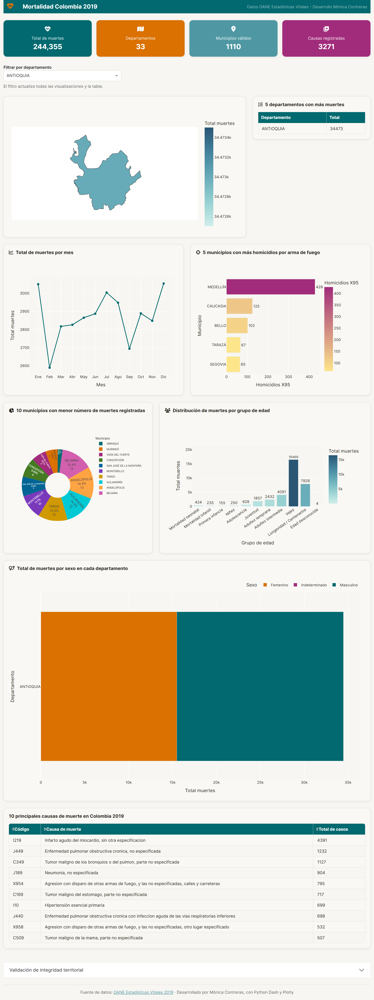
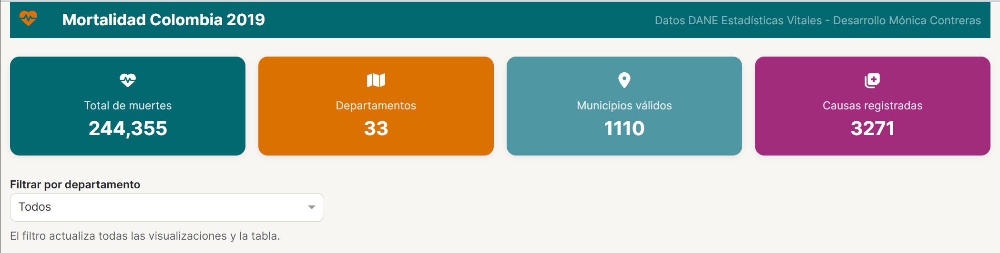

### 1. Mapa Visualización distribución muertes por departamento
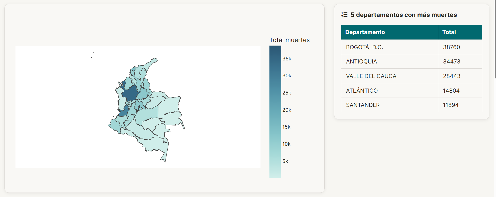
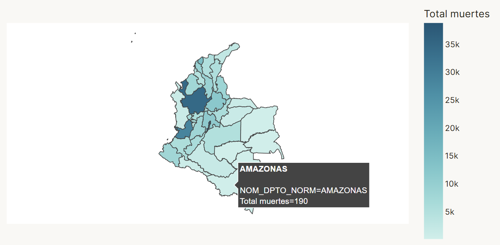
Muestra la concentración de muertes en cada departamento mediante una
escala de color secuencial. Bogotá D.C., Antioquia y Valle del Cauca
concentran los mayores volúmenes, reflejando densidad poblacional y
condiciones epidemiológicas.

### 2. Gráfico de líneas — Muertes por mes
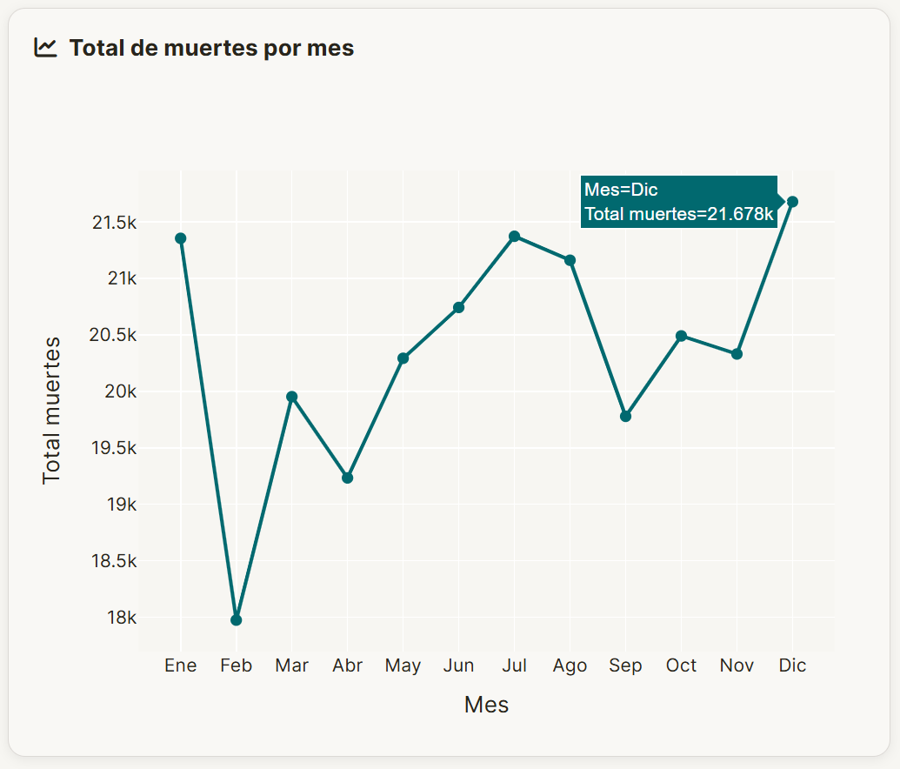
Revela la variación estacional de la mortalidad. Se observan picos al
inicio y cierre del año, asociados a patrones climáticos, enfermedades
respiratorias y accidentalidad vial.

### 3. Gráfico de barras — 5 ciudades más violentas
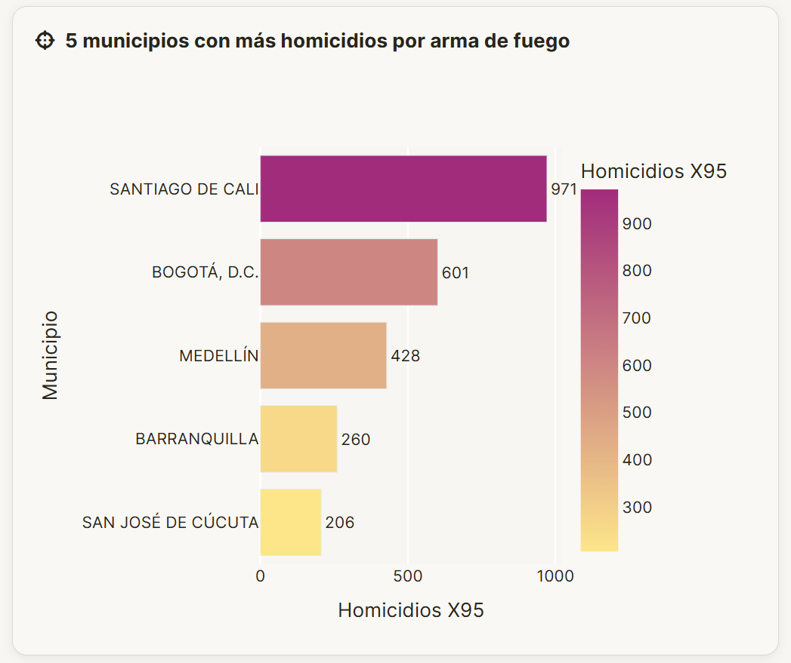
Identifica los municipios con mayor número de homicidios bajo el código
X95 (agresión con disparo de arma de fuego), insumo clave para políticas
públicas de seguridad.

### 4. Gráfico circular — 10 ciudades con menor mortalidad
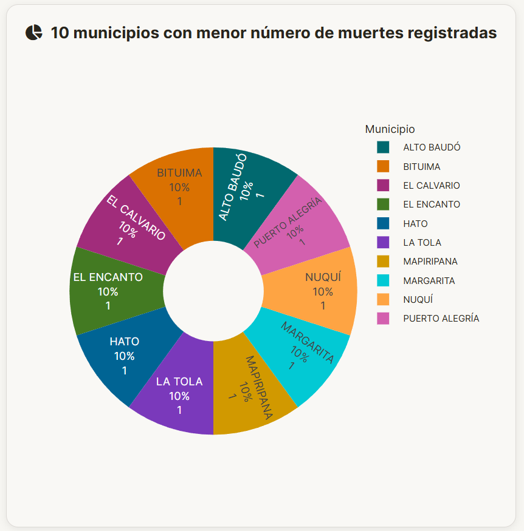
Evidencia municipios con menor carga de mortalidad, en su mayoría
localidades de baja densidad poblacional en zonas rurales.

### 5. Histograma — Grupos de edad
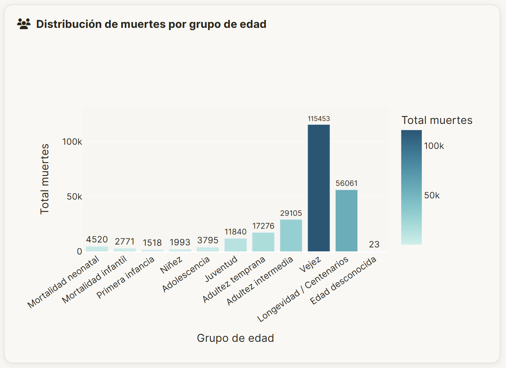
Concentración de muertes en el grupo de vejez (60-84 años), con un
pico secundario en mortalidad neonatal e infantil.

### 6. Barras apiladas — Muertes por sexo y departamento
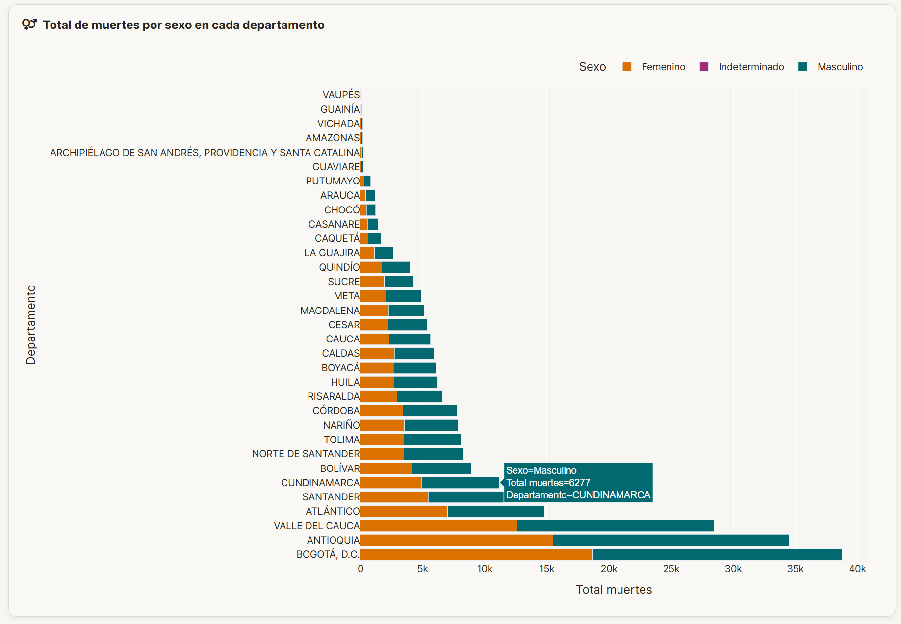
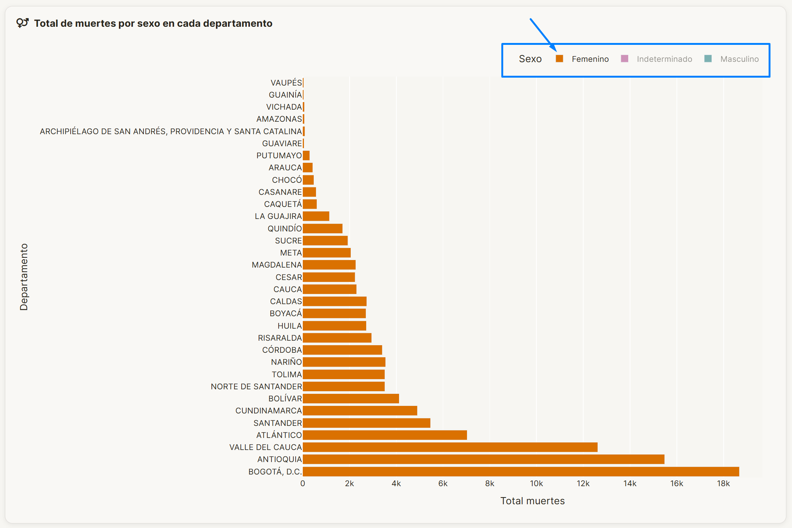
Compara la distribución entre hombres y mujeres por departamento. La
mortalidad masculina supera a la femenina en la mayoría de los
departamentos, especialmente en causas externas.

### 7. Tabla — 10 principales causas de muerte
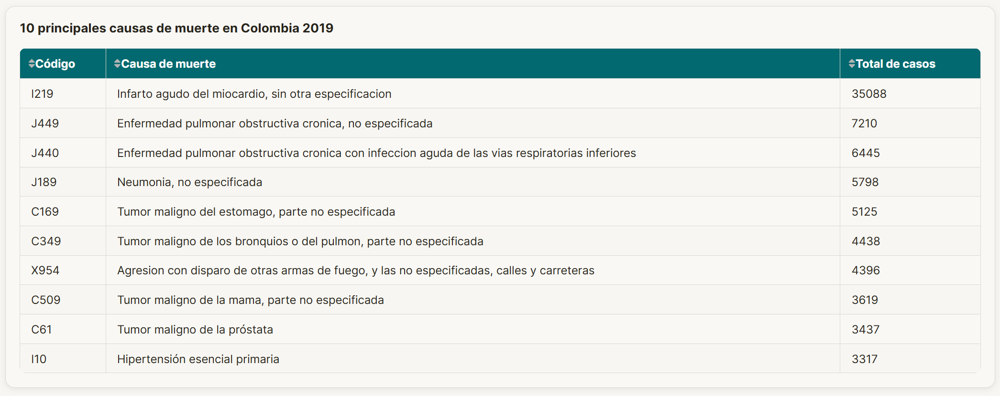
Lista ordenada por total de casos con código CIE-10 y descripción. Las
enfermedades del sistema circulatorio lideran de forma consistente.


## Fuentes de datos
Los datos empleados en la aplicación provienen de fuentes oficiales del DANE, utilizadas en el desarrollo del proyecto:
- DANE. Estadísticas Vitales. Mortalidad no fetal 2019.
- DANE. Tabla de códigos de muerte para clasificación de causas.
- DANE. División Político-Administrativa de Colombia, DIVIPOLA.


## Informe
El repositorio incluye el informe final del proyecto en formato PDF dentro de la carpeta `informe/`.


---

Maestría en Inteligencia Artificial  
Aplicaciones I  
Mónica Contreras
Mayo de 2026